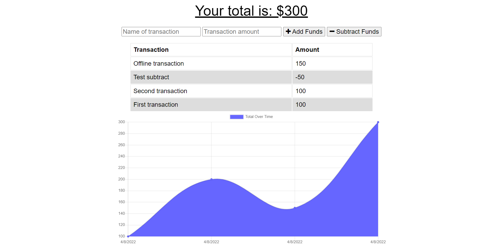

# gordon-budget-tracker

## Description

Budget tracker application that allows for offline access and functionality for the user.  

## Table of Contents

*[Installation](#installation)

*[Usage](#usage)

*[License](#license)

*[Contributing](#contributing)

*[Questions](#questions)

## Installation

You can access the application in Heroku [here](https://fierce-lake-77648.herokuapp.com/), or you can clone the repository.  Once the repository has been cloned, run npm install to ensure all required dependencies are added.  After that, type npm start in the command line and open localhost:3001 in your browser.

## Usage

To use the budget tracker, type the withdrawal or deposit description in the "Name of transaction" field.  Then type in the amount of the withdrawal or deposit in the "Transaction amount" field.  Finally, click the applicable "Add Funds" or "Subtract Funds" button and the transaction will be recorded.  The transaction record list and "Total Over Time" graph will update online or offline.

## License
This application is covered under the [MIT](./License/MIT.txt) license.
  
## Contributing

Pull requests are welcome. For major changes, please open an issue first to discuss what you would like to change.

## Questions

If you have any questions, please contact me by [email](mailto:vprmatrix55@gmail.com) or through [Github](https://github.com/Mike2481)

